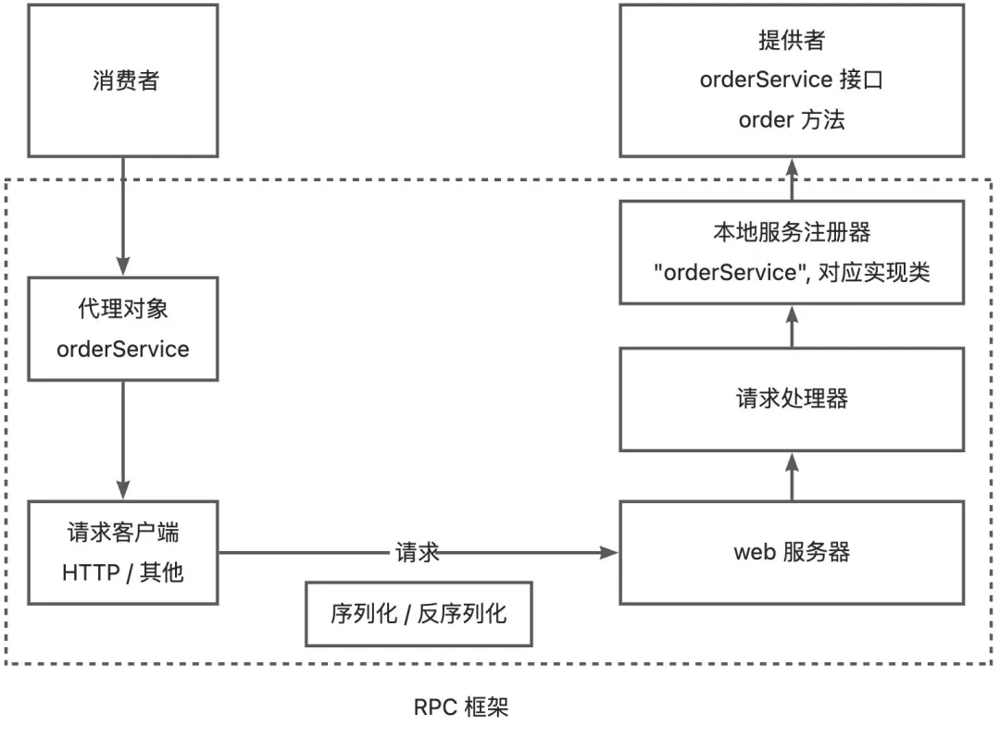

项目整体思路：
    provider：调用rpc创建web服务，rpc会将其class进行注册。
    消费者：调用service，rpc反射class去调用该服务。

假如provider有个方法 User getUserName(User user);这个方法在UserService的接口中。
消费者创建一个User user = new User("xlm")后去调用userService.getUserName(user);
但实际上，userService的实现类在provider中，并不在consumer中，所以要把provider注册在rpc的map中，
当consumer去调用时，通过动态代理获取一个userService，这个动态代理会invoke中就是去实现，它实现是通过http请求
去实现。那么http请求是访问哪里呢？其实是provider会将方法注册到rpc中，rpc会为其创建一个web服务器，因此只需要访问该
服务器就行了。如何获取服务器地址呢，就需要注册中心了。

在实现过程中，consumer知道的只是 类名、方法名、方法参数。rpc的map中key是方法名、value是类，因此可以通过反射来
获取这个方法的各个信息，然后去调用就行了。

